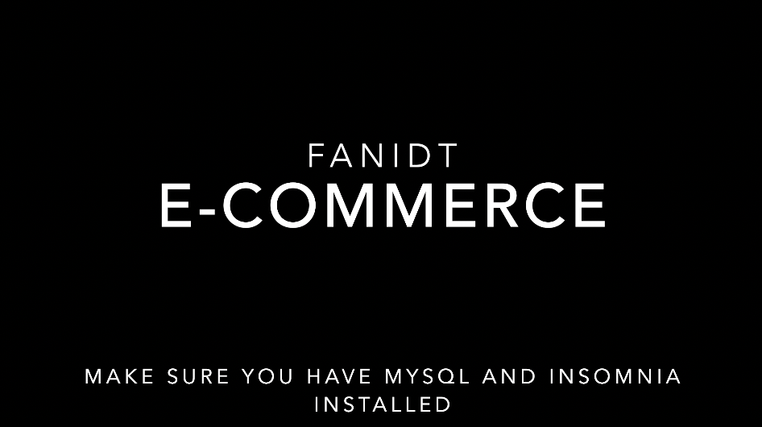

# E-COMMERCE BACK END

 ## Link to deployed application/Repository:  
  https://github.com/fanidt/e-commerce

 # Table of contents  
 -[Description](#Description)  
 -[UserStory] (#UserStory)  
 -[Badges](#Badges)  
 -[Screenshot](##Screenshot)  
 -[Installation](#Installation)  
 -[Usage](#Usage)  
 -[Support](#Support)  
 -[Contributions](#Contributions)  
 -[Authors](#Authors)  
 -[License](#Licence)  

  ## Description:  
  The back-end for an e-commerce website

  ## User Story:  
  AS A manager at an internet retail company  
  I WANT a back end for my e-commerce website that uses the latest technologies  
  SO THAT my company can compete with other e-commerce companies
  
  ## Badges:  
  
  
  ## Screenshot:  
    (https://youtu.be/hbzw2S3HygA)
  
  ## Installation:  
  Download file to your computer
  Open the command line
  Type npm install
  Login to mysql
  Add the database (source db/schema.sql)
  Type exit
  Type npm run seed
  Type npm start to start the database

  ## Usage:  
  Open insomnia or your prefered application

  ## Support:  
  Contact us by email at: deltorofanie@gmail.com  
  Contact us at Github at: https://github.com/fanidt

  ## Contributions:  
  No contributions allowed

  ## Authors:  
  fanidt
  
  ## Licence:  
  MIT  
  License Link: https://opensource.org/licenses/MIT

